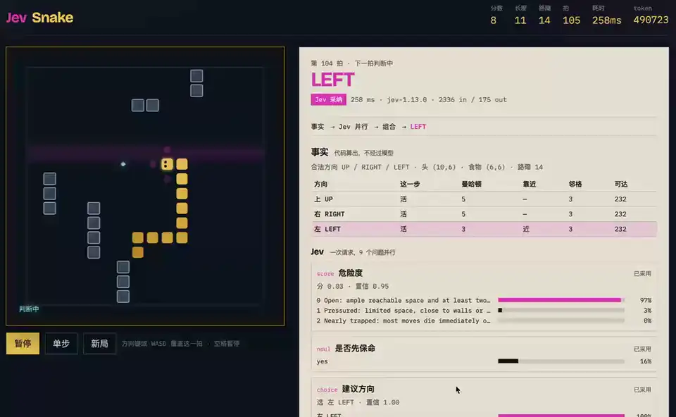

# Jev Snake

[](https://github.com/ximing/jev-snake-game/blob/main/docs/demo.mp4)

Vite 棋盘 + Hono 服务端，用 TypeSafe 的 Jev 做每一步判断。蛇自动跑，右侧决策台展示事实、Jev 答案和代码组合路径。点上方预览可看[完整录屏](https://github.com/ximing/jev-snake-game/blob/main/docs/demo.mp4)。

详细介绍见博客：[Jev：System One 模型的思考和尝试](https://ximing.ren/post/2026/09-21-jev-system-one/)。

## 结构

```
apps/web       Vite + TypeScript 前端
apps/server    Hono，调用 @typesafe-ai/sdk
packages/game  共享规则、候选事实、compose 门控
```

pnpm workspace。密钥只在服务端读取。每局开场随机铺 12–20 格静态路障（短墙），避开出生走廊，并保证食物仍可达。

## 运行

```bash
cp .env.example .env
# 填入 TYPESAFE_API_KEY
pnpm install
pnpm dev
```

- 前端 http://127.0.0.1:5173
- 判断 API http://127.0.0.1:8787

## 这一拍怎么走

1. 代码算出合法方向、是否立刻死亡、曼哈顿、连通空间。
2. 只有一个安全方向，或方向键覆盖：不调 Jev。
3. 否则一次 `systemOne` 并行问危险度、是否保命、建议方向，以及每个方向的安全/进度 Noul。
4. 代码用阈值组合：保命优先，否则在置信足够时听 Choice，否则按进度回退。
